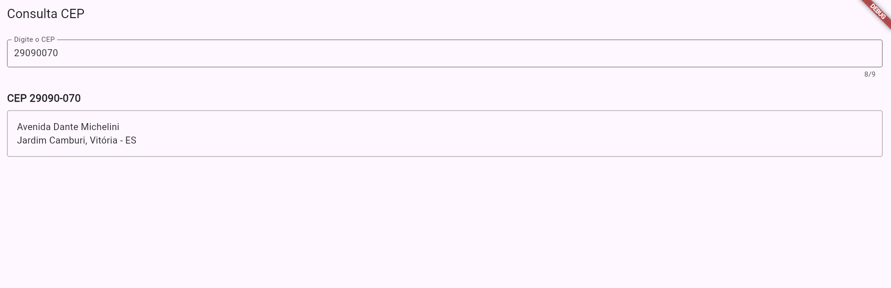

# ConsultaCEP - Aplicativo de Consulta de Endereço por CEP

## Descrição do Projeto
Aplicativo Flutter para consulta de endereços através do CEP, utilizando a API ViaCEP. O aplicativo permite que os usuários digitem um CEP e recebam as informações completas do endereço correspondente.

## Funcionalidades
- Consulta de endereço por CEP
- Formatação automática do CEP (XXXXX-XXX)
- Exibição clara das informações do endereço
- Tratamento de erros para CEPs inválidos ou não encontrados

## Tecnologias Utilizadas
- Flutter 3.x
- Dart 3.x
- Pacote http para requisições à API
- ViaCEP (API pública de consulta de CEPs)

